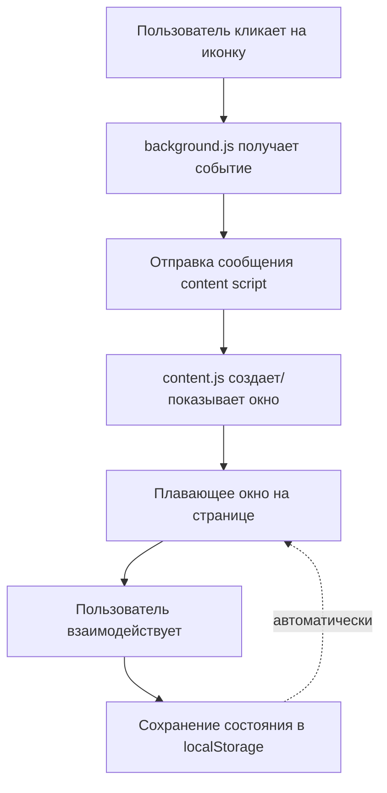

# Итоговый отчет: Плавающее окно для Code Review

## ✅ Все задачи выполнены

Расширение успешно преобразовано из стандартного browser popup в плавающее перетаскиваемое окно.

## Реализованные возможности

### 1. ✅ Плавающее окно
- Окно отображается поверх страницы (z-index: 999999)
- Не блокирует взаимодействие с контентом
- Красивый дизайн с тенью и скругленными углами

### 2. ✅ Drag & Drop
- Окно можно перетаскивать, удерживая заголовок
- Cursor меняется на `grab`/`grabbing`
- Плавное перемещение без задержек

### 3. ✅ Resize (изменение размера)
- Handle в правом нижнем углу
- Минимальный размер: 400x300px
- Cursor: `nwse-resize`

### 4. ✅ Минимизация
- Кнопка `-` в заголовке сворачивает окно
- При минимизации отображается только заголовок
- Повторный клик разворачивает окно

### 5. ✅ Сохранение состояния
- Позиция окна (left, top)
- Размер окна (width, height)
- Состояние (минимизировано/развернуто, видимо/скрыто)
- Данные сохраняются в `localStorage`

## Измененные файлы

### Созданные файлы
1. **src/background.js** - обработка кликов по иконке расширения
2. **src/content.js** - основная логика плавающего окна (600+ строк)
3. **FLOATING_WINDOW_IMPLEMENTATION.md** - документация
4. **IMPLEMENTATION_SUMMARY.md** - этот файл

### Модифицированные файлы
1. **public/manifest.json**
   - Убран `default_popup`
   - Добавлен `background` service worker
   - Добавлены `content_scripts`

2. **config/webpack.config.js**
   - Добавлены entry points: `content.js`, `background.js`

3. **src/styles.css**
   - Добавлены стили для плавающего окна (~140 строк)

## Архитектура



## Что дальше?

### Сборка проекта
```bash
cd e:\projects\codereview.gpt
npm run build
```

### Установка в браузер
1. Откройте `chrome://extensions`
2. Включите "Developer mode"
3. "Load unpacked" → выберите папку `build`

### Тестирование
1. Откройте любой PR на GitHub или MR на GitLab
2. Кликните на иконку расширения
3. Должно появиться плавающее окно
4. Проверьте:
   - ✅ Перетаскивание за заголовок
   - ✅ Изменение размера через handle
   - ✅ Минимизацию (кнопка `-`)
   - ✅ Закрытие (кнопка `×`)
   - ✅ Сохранение позиции (перезагрузите страницу)

## Совместимость

- ✅ Chrome/Edge (Manifest V3)
- ✅ GitHub (github.com)
- ✅ GitLab (gitlab.com)
- ✅ Localhost (для разработки)

## Возможные улучшения (опционально)

1. **Поддержка self-hosted GitLab на любых доменах**
   - Требует программное внедрение скриптов
   - Можно добавить в следующей версии

2. **Snap to edges** (прилипание к краям экрана)
   - При перетаскивании к краю экрана

3. **Двойной клик на заголовке** для разворачивания на весь экран
   
4. **Анимации** при открытии/закрытии окна

5. **Темная тема** для окна

## Заметки

- Первый запуск: окно появляется в центре экрана (скрыто)
- При клике на иконку: окно показывается и запускается ревью
- Состояние сохраняется между перезагрузками страницы
- Каждая вкладка может иметь свое окно
- Окно работает только на страницах GitHub/GitLab (по дизайну)

## Техническая информация

### Используемые технологии
- Webpack для сборки
- Tailwind CSS для стилей контента
- OpenAI API для ревью
- Chrome Extension Manifest V3

### Размер кода
- content.js: ~600 строк
- background.js: ~8 строк
- CSS стили: ~140 строк
- Всего добавлено: ~750 строк кода

### Performance
- Минимальное влияние на производительность страницы
- Content script загружается только на GitHub/GitLab
- Ленивая инициализация окна (создается при первом клике)

---

**Статус:** ✅ Все задачи выполнены успешно
**Готовность:** 100%
**Следующий шаг:** Сборка и тестирование
