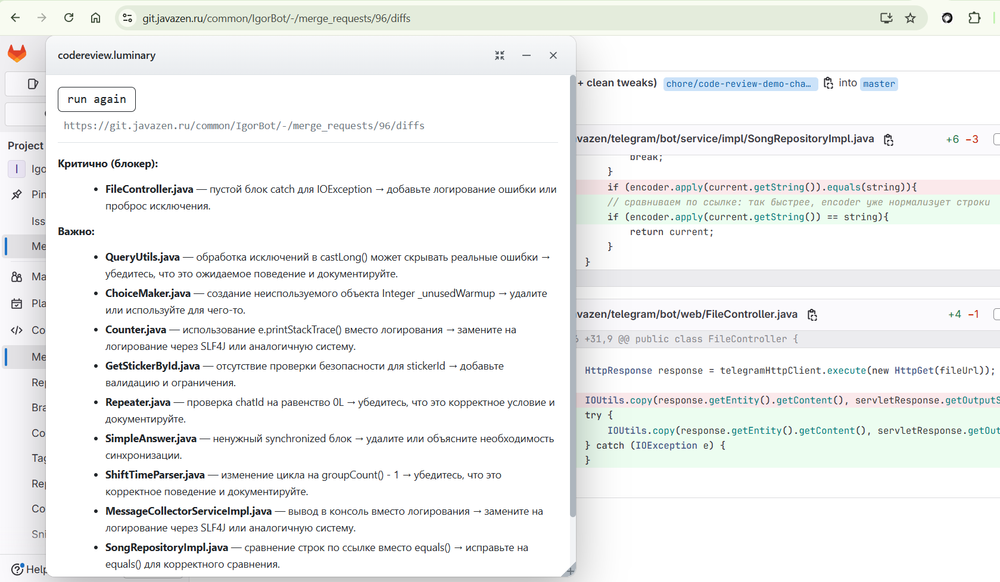
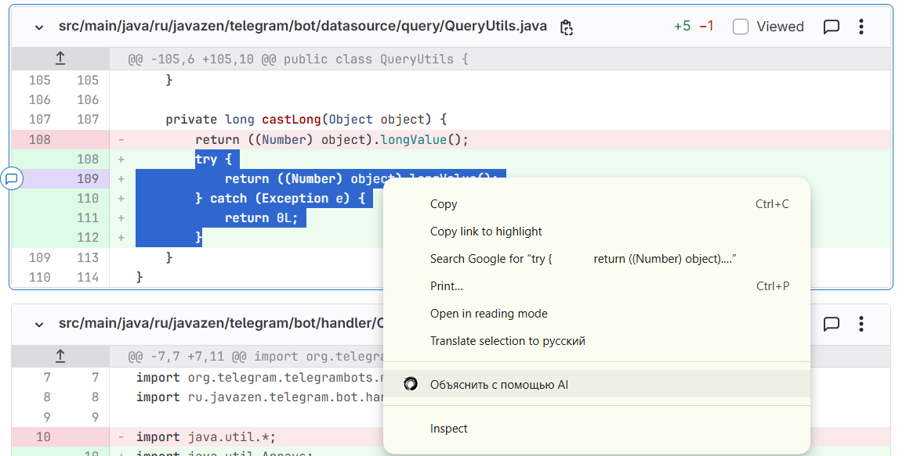
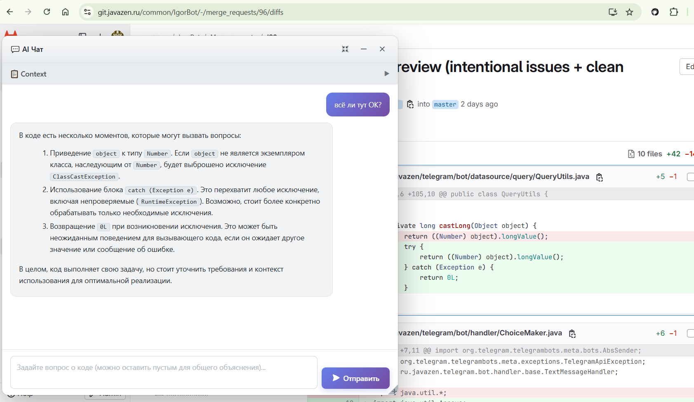
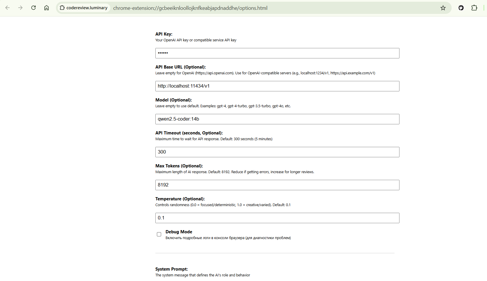

# codereview.luminary

Chrome extension for **AI review of full GitHub PRs / GitLab MRs** and **explaining selected text** via any **OpenAI-compatible** HTTP API (OpenAI, OpenRouter, local servers, etc.).

## Features

### Connect any compatible LLM

Point the extension at your provider: **API key**, **base URL**, **model**, plus **temperature** and **max tokens** for responses. If the API speaks the usual chat-completions-style protocol, it works.

### Whole MR / PR review



On a PR or MR page, run one review over the **entire change**: title, description, commits, and **full diff**. You get a single streamed summary-style review in the floating panel.

**Size limit:** the diff is split **per file**. Each file’s diff block is capped at **15,384 characters** (~4K tokens); longer blocks are **truncated** and a warning is shown. Very large MRs may still hit provider context limits—trim or review in parts if needed.

### Explain selection (context menu)





Select text on any page → right-click → **«Объяснить с помощью AI»** → a floating window explains the selection; you can chat further in the same thread. New selection starts a fresh explain session.

## Configuration

Extension icon → **Options** (opens a tab). Key fields: API key, base URL, model, timeout, max tokens, temperature, and customizable prompts (system, review, final, explain).



## Installation

### Chrome Web Store

Not published yet

### Build from source

```bash
git clone https://github.com/asmal95/codereview.luminary.git
cd codereview.luminary
npm install
npm run build
```

Load the `build` folder at `chrome://extensions` → Developer mode → **Load unpacked**.

## Privacy

API calls go only to your endpoint. Keys stay in Chrome’s local storage.

## Browsers

Chrome and other Chromium-based browsers (Edge, Brave, …).

## License

MIT — see [LICENSE.txt](LICENSE.txt).

Fork based on [sturdy-dev/codereview.gpt](https://github.com/sturdy-dev/codereview.gpt).
